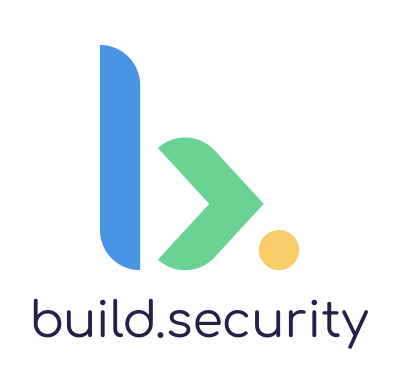

# opa-express-middleware
<p align="center"></p>

## Abstract
[build.security](https://docs.build.security/) provides simple development and management of the organization's authorization policy.
opa-express-middleware is a Node.js express middleware intended for performing authorizing requests against build.security pdp/[OPA](https://www.openpolicyagent.org/).

## Data Flow
<p align="center"> </p>

## Usage

Before you start we recommend completing the onboarding tutorial.

---
**Important note**

To simplify the setup process, the following example uses a local [build.security pdp instance](https://docs.build.security/policy-decision-points-pdp/pdp-deployments/standalone-docker-1).
If you are already familiar with how to run your PDP (Policy Decision Point), You can also run a pdp on you environment (Dev/Prod, etc).

In that case, don't forget to change the **hostname** and the **port** in your code.

---

### Simple usage
```js
const express = require('express');
const bodyParser = require('body-parser');
const extAuthz = require('@build-security/opa-express-middleware');
const port = 3000;

const app = express();

const extAuthzMiddleware = extAuthz.authorize((req) => ({
    port: 8181,
    hostname: 'http://localhost',
    policyPath: '/authz/allow',
}));


app.use(bodyParser.json(), extAuthzMiddleware);

app.listen(port, () => {
  console.log(`Now listening on http://localhost:${port}`)
});
```
### Mandatory configuration
 1. `hostname`: The hostname of the Policy Decision Point (PDP)
 2. `port`: The port at which the OPA service is running
 3. `policyPath`: Full path to the policy (including the rule) that decides whether requests should be authorized

### Optional configuration
 1. `allowOnFailure`: Boolean. "Fail open" mechanism to allow access to the API in case the policy engine is not reachable. **Default is false**.
 2. `includeBody`: Boolean. Whether or not to pass the request body to the policy engine. **Default is true**.
 3. `includeHeaders`: Boolean. Whether or not to pass the request headers to the policy engine. **Default is true**
 4. `timeout`: Integer. Amount of time to wait before request is abandoned and request is declared as failed. **Default is 1000ms**.
 5. `enable`: Boolean. Whether or not to consult with the policy engine for the specific request. **Default is true**
 6. `enrich`: Object. An object to attach to the request that is being sent to the policy engine. **Default is an empty object {}**

### Advanced example
The following example will:
- consult with the policy engine only for GET requests
- add a field named "serviceId" with the value 1 to the request
- provide route parameters to the PDP as input. (For this to work, the middleware can't be applied globally using `app.use`)
- an endpoint can declare the required permission the client needs in order to access it
```js
const express = require('express');
const bodyParser = require('body-parser');
const extAuthz = require('@build-security/opa-express-middleware');

const app = express();

const extAuthzMiddleware = extAuthz.authorize((req) => ({
    port: 8181,
    hostname: 'http://localhost',
    policyPath: '/authz/allow',
    enable: req.method === "GET",
    enrich: { serviceId: 1 }
}));

app.use(bodyParser.json());

app.get('/region/:region/users/:userId', extAuthz.permissions('user.read'), extAuthzMiddleware, (req, res) => {
    res.send('allowed');
});
```

### PDP Request example

This is what the input received by the PDP would look like.

```
{
   "input":{
      "request":{
         "method":"GET",
         "query":{
            
         },
         "path":"/region/1/users/2",
         "scheme":"http",
         "host":"localhost",
         "body":{
            
         },
         "headers":{
            "host":"localhost:3000",
            "user-agent":"curl/7.64.1",
            "accept":"*/*"
         }
      },
      "source":{
         "port":56038,
         "ipAddress":"::1"
      },
      "destination":{
         "port":3000,
         "ipAddress":"::1"
      },
      "resources":{
         "attributes":{
            "region":"1",
            "userId":"2"
         },
         "permissions":[
            "user.read"
         ]
      },
      "serviceId":1
   }
}
```

If everything works well you should receive the following response:

```
{
    "decision_id":"ef414180-05bd-4817-9634-7d1537d5a657",
    "result":true
}
```